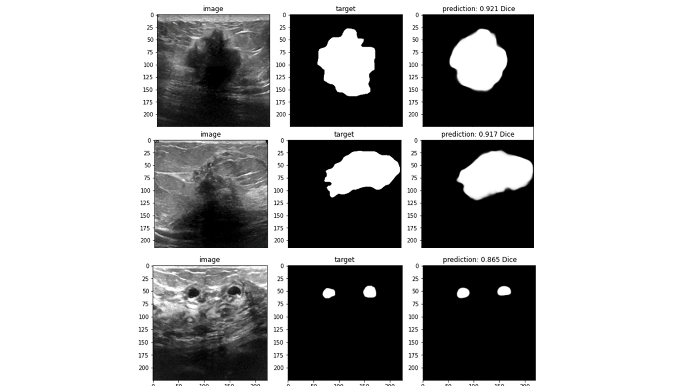

# APS360-Early-Breast-Cancer-Detection-with-Ultrasound-Images
This repo contains cleaned-up versions of the model building, training, data processing, and evaluation notebooks used throughout this project. All of the model training was done through Google Colab and Google Drive, and these notebooks provide the best summary of all the code used in this project to produce the final results. The best models performed quite well on new data, and a sample from the unseen test data is shown here.

